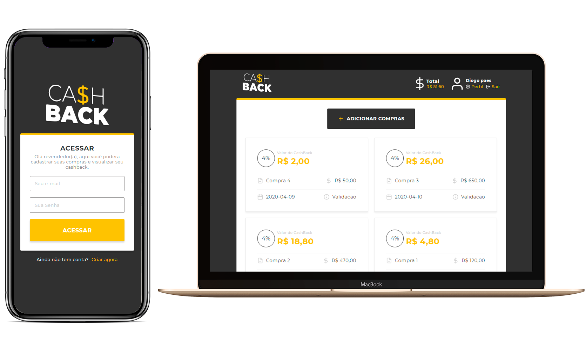

<h3 align="center">

  
<br>
Project Test (CashBack)
</h3>



# Backend

I chose to use Strapi.io for back development because it is faster and more agile since the idea was to test the mobile's abilities. And I used the --quickstart command to create a base in sqlite.
[**Visit the website.**](https://strapi.io/documentation/3.0.0-beta.x/getting-started/quick-start.html#_1-install-strapi-and-create-a-new-project)<br>

## :computer: Run it!

```bash
# enter the folder
cd server

# Install the dependencies
yarn install

# Run the backend server (A base will be created with sqlite)
yarn develop

```
**:warning:Note:warning:**<br>
A database populated in the utils folder has been added.
To add, run the yarn develop command once and then in the tmp folder remove the data.db file and add it from the utils folder. (Access data admin/admin1)

# Frontend

## :computer: Run it!

```bash
# enter the folder
cd server

# Install the dependencies
yarn install

# Run the frontend server
yarn start

```

Made with much ♥ by Diogo Paes 👋 <a href="https://www.linkedin.com/in/diogopaes/">Talk to me!</a>